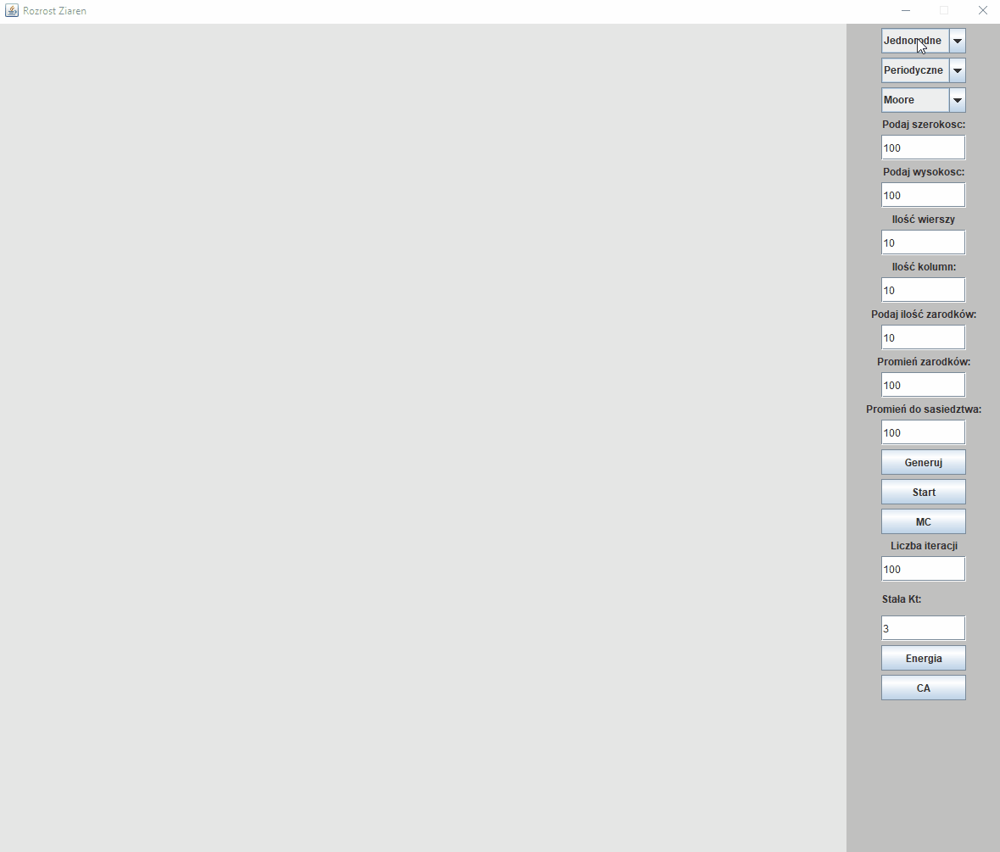

### Grain growth - Project
***

This project was created for multi-scale modeling classes 
and raised the topic which described [here](https://en.wikipedia.org/wiki/Grain_growth)

**We can choose one options of:**

1. Kinds of nucleations
    * homogeneous
    * with a ray
    * random
    * user selection
2. Kinds of binary conditions
    * absorbing
    * periodic
3. Kinds of neighbourhood
    * Moore
    * Pentagonal
    * Hexagonal
    * Von Neumann
    * with a ray

